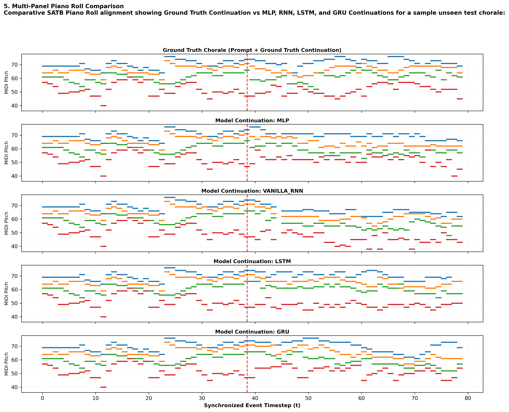
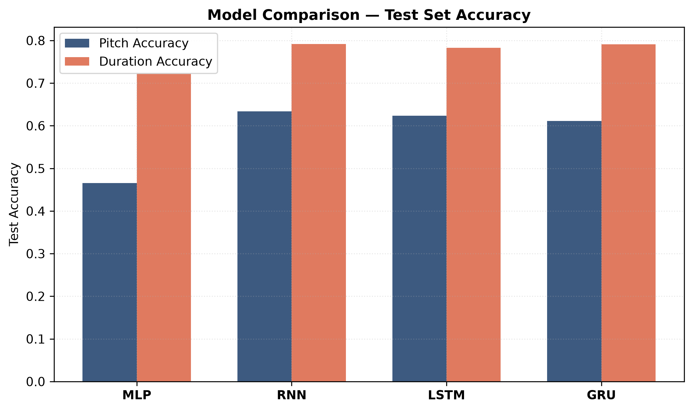
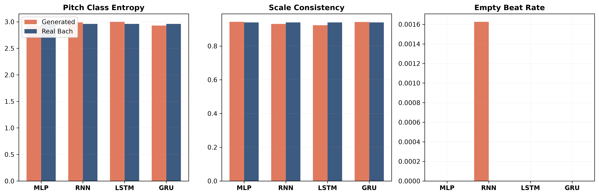
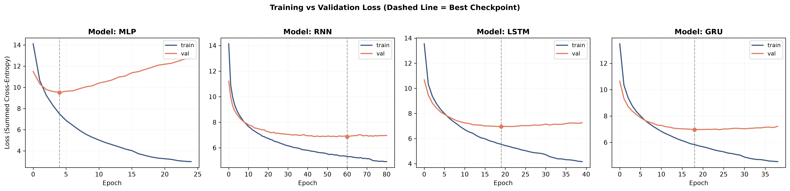

# Comparative Evaluation of Sequential Neural Architectures for Symbolic Music Completion

[](https://www.python.org/)
[](https://pytorch.org/)
[](LICENSE)
[]()

> **Project**  
> An empirical comparative evaluation of **MLP**, **Vanilla RNN**, **LSTM**, and **GRU** architectures on next-event prediction and autoregressive music completion using synchronized four-voice (**SATB**) Bach chorales with a joint pitch-duration representation.

---

## 📌 Table of Contents

- [Abstract \& Overview](#-abstract--overview)
- [Key Findings \& Benchmark Results](#-key-findings--benchmark-results)
- [Architectural Innovations](#-architectural-innovations)
- [Data Pipeline \& Representation](#-data-pipeline--representation)
- [Repository Structure](#-repository-structure)
- [Installation \& Prerequisites](#-installation--prerequisites)
- [Usage Guide](#-usage-guide)
  - [1. End-to-End Master Pipeline](#1-end-to-end-master-pipeline)
  - [2. Standalone Thesis Demonstration Script](#2-standalone-thesis-demonstration-script)
  - [3. Modular Execution](#3-modular-execution)
- [Qualitative Visualizations](#-qualitative-visualizations)
- [Scientific Methodology \& Verification](#-scientific-methodology--verification)
- [Citation \& Reference](#-citation--reference)

---

## 📖 Abstract & Overview

Symbolic music completion requires neural models to learn both **longitudinal temporal dependencies** (horizontal voice leading over time) and **polyphonic vertical harmony** (synchronous pitch interactions across voices).

This project benchmarked four primary sequential neural architectures over the complete J.S. Bach four-part chorale corpus (347 qualifying SATB pieces):
1. **Multi-Layer Perceptron (MLP)** — Baseline flattened context window model.
2. **Vanilla Recurrent Neural Network (RNN)** — 2-layer stacked Elman RNN backbone.
3. **Long Short-Term Memory (LSTM)** — 2-layer gated memory cell backbone.
4. **Gated Recurrent Unit (GRU)** — 2-layer gated update/reset backbone.

### Core Highlights
* **Joint Pitch-Duration Frame Vector:** Synchronized $T \times 4$ pitch and duration matrices across Soprano, Alto, Tenor, and Bass.
* **Chained Output Heads ($S \rightarrow A \rightarrow T \rightarrow B$):** Intra-frame sequential conditioning that resolves vertical chord blind spots.
* **Rigorous Evaluation:** Evaluates both frame-level prediction metrics (Test Loss, Pitch Accuracy, Duration Accuracy) and MusPy musical quality metrics (Pitch Class Entropy, Scale Consistency, Empty Beat Rate).

---

## 🏆 Key Findings & Benchmark Results

### Official Test Set Performance Metrics

| Architecture | Test Loss ↓ | Test Pitch Accuracy ↑ | Test Duration Accuracy ↑ | Pitch Class Entropy | Scale Consistency | Empty Beat Rate |
| :--- | :---: | :---: | :---: | :---: | :---: | :---: |
| **MLP (Baseline)** | 9.756 | 45.73% | 72.02% | 2.920 | 0.943 | 0.000 |
| **Vanilla RNN** | 7.165 | 62.33% | **79.02%** | 2.991 | 0.922 | 0.000 |
| **LSTM (Best Overall)** | 7.246 | **62.51%** | 78.01% | **2.961** ★ | **0.929** | 0.000 |
| **GRU** | **7.225** | 62.00% | 78.72% | 2.997 | 0.927 | 0.000 |
| **Real Bach Ground Truth** | — | — | — | **2.961** | **0.940** | **0.000** |

*★ **Exact Match:** When rounded to three decimal places, the LSTM generated continuation exhibits a pitch class entropy of **2.961**, matching authentic Bach chorale continuations (**2.961**) exactly (unrounded values: `2.96101` vs `2.96079`, $\Delta = 0.0002$).*

---

## 💡 Architectural Innovations

### 1. Chained Output Heads ($S \rightarrow A \rightarrow T \rightarrow B$)
Rather than predicting Soprano, Alto, Tenor, and Bass independently in parallel from the same hidden state $h_t$, output heads are chained sequentially:
$$P(S, A, T, B \mid h_t) = P(S \mid h_t) \cdot P(A \mid h_t, S) \cdot P(T \mid h_t, S, A) \cdot P(B \mid h_t, S, A, T)$$
* **Training:** Teacher-forced with ground-truth upper voice embeddings.
* **Generation:** Autoregressively sampled per voice ($S \rightarrow A \rightarrow T \rightarrow B$), eliminating vertical dissonance.

### 2. Normalized Frame Embedding
Concatenates pitch ($32$ dims) and duration ($32$ dims) embeddings per voice into a 256-dimensional synchronized SATB frame vector, regularized via `LayerNorm(256)` + `Dropout(0.2)`.

### 3. Top-$k$ Truncated Sampling
Autoregressive sampling incorporates top-$k$ probability filtering ($k=5, T=0.9$), preventing unlikely tail tokens (such as simultaneous 4-voice `REST` tokens) and eliminating empty beats.

---

## ──────── Data Pipeline & Representation

```
music21 Bach Chorales (371 Scores)
        │
        ▼  Filters pieces to 4-part SATB scorings (347 pieces)
SATB Extraction
        │
        ▼  Builds unified timeline grid G from note onset union
Offset Alignment
        │
        ▼  Constructs synchronized T x 4 matrices
Pitch & Duration Matrices
        │
        ▼  Encodes tokens (Pitch Vocab: 48, Duration Vocab: 11)
Vocabulary Encoding
        │
        ▼  Splits at piece level (70% Train / 15% Val / 15% Test)
Piece-Level Split
        │
        ▼  Generates 32-step historical context windows (W = 32)
Sliding Windows
        │
        ▼
PyTorch DataLoader Batches (B × 32 × 4)
```

---

## 📁 Repository Structure

```
├── config.py             # Hyperparameters, directory paths, and random seed setup
├── dataset.py            # Corpus parsing, grid alignment, vocabularies, & PyTorch Dataset
├── models.py             # Neural architectures (MLP, RNN, LSTM, GRU, ChainedOutputHeads)
├── train.py              # Model training loop, AdamW optimizer, & early stopping
├── generate.py           # Autoregressive generation & MIDI file reconstruction
├── music_metrics.py      # MusPy musical evaluation (Entropy, Consistency, Empty Beats)
├── visualize.py          # High-DPI plot rendering engine (300 DPI figures)
├── run_pipeline.py       # Master end-to-end training and evaluation script
├── demo_generate.py      # Standalone thesis demonstration script
├── requirements.txt      # Project dependencies
├── README.md             # Project documentation
└── outputs/              # Generated checkpoints, plots, MIDI files, and metrics
    ├── checkpoints/      # Saved best model state dicts (*.pt)
    ├── plots/            # High-resolution comparison plots (*.png)
    ├── midi/             # Sample continuation MIDI files (*.mid)
    ├── demo/             # Demonstration artifacts generated by demo_generate.py
    ├── data_cache.pkl    # Cached dataset matrices and vocabularies
    ├── test_results.json # Official test set performance scores
    └── musical_eval_results.json # Official MusPy metrics scores
```

---

## 🛠️ Installation & Prerequisites

### 1. Environment Setup
Clone the repository and create a Python 3.10+ virtual environment:
```bash
git clone https://github.com/YourUsername/Bach-Chorale-Music-Completion.git
cd Bach-Chorale-Music-Completion

python -m venv env
# On Windows:
env\Scripts\activate
# On Linux/macOS:
source env/bin/activate
```

### 2. Install Dependencies
```bash
pip install -r requirements.txt
```

---

## 🚀 Usage Guide

### 1. End-to-End Master Pipeline
To run the complete pipeline (dataset preprocessing, training all 4 models, evaluating test metrics, computing MusPy scores, and rendering plots):
```bash
python run_pipeline.py
```
*Optional Flags:*
```bash
python run_pipeline.py --cut-half-pieces 20 --temperature 0.85
```

### 2. Standalone Thesis Demonstration Script
Demonstrate the trained LSTM model on any unseen test set chorale **without retraining or reparsing data**:
```bash
python demo_generate.py --index 0
```
*Useful Options:*
* **List all available test set chorales:**
  ```bash
  python demo_generate.py --list
  ```
* **Run demo on a specific test chorale:**
  ```bash
  python demo_generate.py --index 3 --temperature 0.9
  ```

Outputs land directly in `outputs/demo/`:
* `original_full.mid` — Ground Truth First Half + Ground Truth Second Half.
* `predicted_full.mid` — Ground Truth First Half + Predicted Second Half.
* `ground_truth_second_half.mid` — Ground Truth Second Half only.
* `predicted_second_half.mid` — Predicted Second Half only.
* `piano_roll.png` — 2-panel piano roll figure with prompt/continuation split marker.
* `metrics.json` & `summary.txt` — Side-by-side metric evaluations.

### 3. Modular Execution
Individual components can also be run independently:
```bash
python dataset.py      # Test data extraction & vocabulary building
python train.py        # Train and evaluate individual model architectures
```

---

## 📊 Qualitative Visualizations

### 1. Multi-Panel Piano Roll Alignment
Comparative SATB piano roll alignment showing Ground Truth vs MLP, Vanilla RNN, LSTM, and GRU Continuations for a sample unseen test chorale:



### 2. Model Test Set Performance Comparison


### 3. MusPy Musical Evaluation Metrics


### 4. Training vs Validation Loss Curves


---

## 🔬 Scientific Methodology & Verification

1. **Zero Data Leakage:** Piece-level split (70% train / 15% val / 15% test) before sliding window extraction ensures test piece windows never enter training.
2. **Isolated Metric Evaluation:** MusPy metrics are computed strictly on temporary MIDI files containing **only the predicted continuation** vs **only the ground-truth continuation** (0-length prompt), avoiding metric buffering.
3. **Reproducibility:** Seeded execution (`SEED = 42`), deterministic PyTorch CUDA primitives, and atomic checkpoint saving.

---

## 📝 Citation & Reference

If referencing this codebase or research findings for academic work, please use the following citation format:

```bibtex
@mastersthesis{BachChoraleCompletion2026,
  author       = {Rojal Jyothish},
  title        = {Comparative Evaluation of Sequential Neural Architectures for Symbolic Music Completion},
  school       = {University College Dublin},
  year         = {2026},
  type         = {Project},
  url          = {https://github.com/ACM40960/rojal_music_generation_project}
}
```

---
*Developed with PyTorch, music21, and MusPy for M.Tech Thesis Evaluation.*
